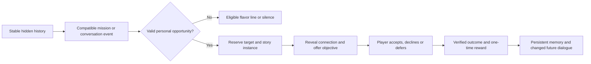

# Character voices, hidden history and personal stories

Status: **proposal only**, October 8, 2026. No runtime implementation, new
character tags, quest rolls, rewards or player-save changes in this pass.

Current extension: conversation-led character establishment, bounded personal
arcs, early disclosed loyalty conflicts and story-matched rewards are described
in the October 8 refinement below. Use the v0.2 authoring contract and single-file
GPT brief linked in the content index for new writing batches.

## Intended experience

Characters notice what is happening, speak in their own voice and occasionally
reveal a personal connection that creates an optional objective. Facts persist;
the player learns a person over time rather than receiving a different random
backstory every mission. AI helps author content offline. Gameplay selects
reviewed content through local rules; it does not call an LLM during combat.

The vision is achievable. The risk is combinatorial content, contradictions and
excessive interruptions. Start with reusable motifs and story templates, not a
separate quest for every race/gender/personality/enemy combination.

## Existing foundations inspected

- `backend/relationships.py`: twelve persistent personality IDs, stable individual
  tastes, service counters, eight recent mission memories and companion talks.
- `backend/prison_recruitment.py`: stable recruitment profiles, personal terms,
  linked Private Contracts, allegiance history and one-time conversion/rewards.
- `backend/races.py`: concrete races, gender restrictions and overlapping race
  families. Family membership does not imply anatomy, feeding needs or culture.
- `backend/combat_encounter_ai.py`: sparse authored tactical speech, personality
  heuristics and combat feedback events suitable for timed bubbles/History.

These are integration points, not evidence that this proposal already exists.
Existing tastes, personalities, authored identities and Champion lore must remain
stable. Ordinary generated characters may acquire compatible history; authored
unique characters need explicit author-approved profiles. No appearance-derived
history, personality or prejudice from portrait tagging.

## Three separate layers

| Layer | Stored information | Example |
| --- | --- | --- |
| Identity and history | Stable traits, facts, relationships, origin and reveal state | Former caravan guard; an unresolved rival; takes pride in craftsmanship |
| Contextual voice | Reviewed lines with eligibility rules and repetition controls | A particular proud dwarf comments on a visible elf opponent |
| Personal story | A persistent instance with cast, state, choices and rewards | Recognize a rival, choose a challenge, resolve or defer it |

Race is one input, not a complete personality. Gender-specific content is allowed
where it serves a particular background or perspective; it should not be the
default explanation for behavior. Complaining, vanity, prejudice, mercy and
humor require compatible individual traits. A Vampire line about blood also
requires the proposed feeding trait and a known suitable living target: the
Deathless family alone cannot establish those facts.

## Character facts and tags

Proposed small starting profile for ordinary characters:

- Existing race, gender, personality and Job.
- One compatible background, one personal motive and one or two voice traits.
- Zero or one latent story hook initially. Not every character needs a tragic
  past, secret relative or rival. Ordinary work, pride, gratitude and friendships
  also create personality.

Use namespaced tags for selection, such as `background:caravan_guard`,
`voice:dry_humor`, `motive:recognition`. Use structured facts for actual history:
relationship ID, target identity, origin, status and provenance. Tags cannot
replace an actual rival record. Histories have exclusivity rules: do not assign
both an incompatible upbringing and occupation without an authored explanation.

Facts record their source: authored, generated at character creation, inherited
from recruitment, or earned through a named event. A hidden fact is still true;
only its visibility changes when revealed. Do not delete resolved history.

Existing saves would receive missing generic traits once through a versioned,
persisted migration. Do not continually derive new histories from names, dates
or random seeds on load. Scope personal target IDs to their story instance; keep
them stable through saves, retreat, death, capture and recruitment.

## Dialogue selection

1. Receive a meaningful event: mission entry, first sight of a relevant enemy,
   completed attack, ally rescue, personal objective result or a camp topic.
2. Build structured context from facts the speaker can know. Mission entry can
   use the disclosed briefing; recognition needs visibility. Do not reveal
   concealed enemies, unknown races, secret objectives or future damage.
3. Filter lines by explicit conditions and bound participants. Nobody comments
   on their own death, recognizes an unseen rival, or addresses a dead ally.
4. Prioritize objective-critical notices, personal recognition, meaningful
   reactions, then ordinary flavor. Silence is a valid result.
5. Apply repetition/novelty weights and choose a complete authored line.
6. Commit the selected ID with the event and emit it at the correct playback
   moment. Repeated commands or reloads reuse the same event; they do not reroll.

Do not concatenate unrelated sentence fragments to simulate variation. Store
full alternatives with shared meaning and a shared family ID. Track repetition
by exact line, semantic family, speaker and player; otherwise eight reworded
blood complaints still feel like the same joke. A reply is an optional paired
exchange requiring both participants and sufficient speech budget, not an
unbounded conversation loop.

Initial pacing targets, subject to playtesting: one ambient entry remark for the
party, usually no more than one ambient combat line per round and never over
critical UI. Personal discoveries can take priority without blocking input.
Keep bubbles short; log the complete line. Do not add random speech delays to
movement or attacks. Match feedback to the completed visual event, just as
damage and summon death playback require. Camp talk supports longer text.

## Stories are not side effects of displayed text

A content line never creates arbitrary quests or grants a perk. A story
coordinator first validates and reserves a playable opportunity, then chooses
the recognition dialogue referring to it. If reservation fails, use ordinary
flavor or remain silent. Muted bubbles or missed visual presentation cannot
prevent progress or cause reward duplication.

Recommended first story: **an old rival**, expressed through several backgrounds
and voices. A proud duelist might want a personal defeat; a merciful character
might want the rival captured; a survivor may want the rivalry settled without
risking the party. These are authored branch choices, not automated assumptions
that remove player control.

### Binding and objective rules

- Prefer a compatible, ordinary existing enemy. A procedural unnamed enemy may
  receive a saved personal identity before exposure, within the existing budget.
  Do not overwrite named lore characters, bosses or another active story role.
- Reserve bindings before recognition. Any newly authored special encounter or
  added unit needs its own reviewed spawn/balance support; dialogue cannot spawn
  unexpected reinforcements or invalidate the mission.
- Show a clear optional objective once revealed: who must do what, to whom,
  whether allied help is permitted, and when it counts. Hidden prerequisites are
  discovery tools, not hidden scoring requirements after acceptance.
- `defeat`, `kill`, `capture` and `win the mission` are distinct outcomes. A
  nonlethal takedown does not automatically count as capture. Use authoritative
  capture/extraction/automatic recovery rules when finalizing an alive prisoner.
- Allow an explicit refusal/defer option. No permanent loss of a unique skill
  because the wrong ally landed a final hit or a randomly selected line was
  missed. A failed optional objective can open a bounded follow-up or close that
  branch with a recorded outcome, according to its authored recovery policy.
- Retreat, actor incapacitation, target escape, target killed by an ally and
  target captured by someone else need explicit outcomes. Never reuse a dead
  rival as a living enemy; a new rival requires a different identity and history.
- Initial rewards should be modest, alternate sidegrades or choices, not
  endlessly stackable stats. New skills/perks require an approved gameplay
  definition and normal slot rules. Writer-created reward names are proposals.

Proposed state lifecycle:

`latent -> offered -> active -> resolved | failed | deferred | declined`

Transitions, actor/target IDs, outcome and reward claim are saved transactionally
using the existing per-player mutation discipline. An offered opportunity does
not become active merely because a line was selected. Remove/resolve the active
hook after completion, but retain completion history and reward receipts.

## Novelty and chance

A single dialogue counter is insufficient. Keep these separate:

- Line and family use counts plus recent IDs/eligible-event cooldowns.
- Story-family opportunities seen, offers accepted/declined, completions and
  failures at the player level; exact story-instance state per character.
- Stable event IDs and one-time reward receipts.

For ordinary flavor, a transparent initial weight is:

`weight = authored_weight * specificity / ((1 + 2*line_uses) * (1 + family_uses))`

Recent repetitions are ineligible until cooldown ends. Clamp the specificity
factor, so an obscure eligibility combination does not always monopolize speech.
This selects among already eligible lines; it does not make every event speak.

For stories, roll a separate opportunity gate **once per eligible meaningful
encounter checkpoint**, not per hover, Talk click, load or combat command. As
initial test values, use a 3% base chance, increasing by 0.5 percentage points
per compatible missed checkpoint up to 10%, with a three-completed-mission gap
after any personal-story offer. Gate only when a valid candidate exists. Pity
never bypasses story conditions and is reset only by a committed valid offer.

After the gate succeeds, select an eligible family with:

`family_weight = base_weight * max(0.1, 1 / (1 + 3*prior_player_offers_of_family))`

Thus first-seen motifs compete at full weight and already seen motifs become
less common, even for another character. An exact completed unique instance has
weight zero. Allow repeatable motifs on distinct compatible characters only when
their template permits it. Declining an offer still counts as exposure. There
must be enough alternative content before novelty weighting can create variety.
Never artificially guarantee a story when none makes sense. These values are
proposal defaults, not release tuning.

Persist event rolls and selection, preventing refresh/retry farming. Do not
store every pointer interaction or unbounded transcript. Retain aggregate counts,
bounded recent history and durable story facts. Queued/selected use and client
display telemetry can be separate; reward eligibility never depends on visual
acknowledgment. Conversation discoveries use once-per-topic/story checkpoints
and meaningful state changes, not a fresh chance on every repeated Talk click.

## Content pipeline and GPT collaboration

Use [the authoring prompt](../content/CHARACTER_STORY_AUTHORING_PROMPT.md) and
[the initial content contract](../content/character-story-contract-v0.1.json).
The [content index](../content/CHARACTER_STORY_CONTENT_INDEX.md) owns maintenance
and pack status; root AGENTS.md requires review when related systems change.
This is a **draft authoring format**, not a supported import endpoint. Freeze
and validate the first small pack before producing thousands of entries.

One-off templates must declare a stable repeat key and a once-per-player scope.
Exact variants share that key, so dialogue rewrites and alternate character
bindings cannot restart the same story. Separate mission-specific one-offs are
valid and should declare the exact relevant mission/story context. Clear active
hooks on resolution, retain the durable completion/retirement record, and never
use novelty downweighting as a substitute for one-off exclusion. See the index
for decline/defer/retry distinctions and future catalogue update requirements.

1. Approve tag meanings, compatibility and a small voice guide.
2. Generate background/voice suggestions in a design batch; review before adding
   any IDs to the registry. Existing personality/race IDs are not invented.
3. Generate short complete dialogue alternatives against that fixed registry.
4. Generate story outlines separately: no executable code, arbitrary flag writes,
   or automatic reward definitions. Review engine support before assigning IDs.
5. Validate JSON, IDs, conditions, placeholders, lengths, duplicate meanings and
   conflicting facts. Simulate representative identities/events; preview exact
   eligibility reasons in dev. Human review checks voice, lore and contradictions.
6. Import reviewed content through versioned tooling in a later implementation.

Batch 40-60 short lines or 4-6 detailed story outlines, returning one complete
JSON file. Large output capacity is useful but does not justify truncated JSON
or mixing unreviewed lore with executable rules. Attach the approved contract
and prior ID manifest on every continuation. GPT need not know player saves.

## Staged delivery recommendation

1. **Voice pilot:** six background profiles, a small trait registry, roughly
   80-120 reviewed lines across mission entry/combat/camp, persisted novelty
   counts and a dev inspector. No new quests or mechanical trait bonuses.
2. **One complete personal story:** the rival, with accepted/declined/deferred
   states, clear objectives, capture/kill/defeat alternatives and one approved
   reward. Reuse current mission/private-contract foundations. Test end to end.
3. **Expand motifs:** mentor, debt, old unit, rescue, profession, generosity and
   other histories; add paired banter and longer conversations only after the
   first story survives save/load and repeated play.

Quality gates: no invented facts, no hidden-enemy disclosure, no reload rerolls,
no duplicate claims, stable histories after recruitment, accurate objective
attribution, no frame-time dialogue scans and sparse readable playback. Sample
selection only at event boundaries, with pools indexed by event; no per-frame
database work or runtime model latency. Test with dialogue hidden, solo parties,
full parties, unavailable actors and exhausted content. A dev report should
explain eligibility, veto, weighting, selected line and bound story IDs.

Do not implement an unrestricted universal rule language. Start with a small
allowlist of facts, predicates and story transitions using existing gameplay
events. Extend it only when reviewed content needs a real missing capability.

## October 8 refinement: conversations establish personal paths

The user's intended loop is **conversation -> saved personal path -> compatible
mission event -> optional personal objective -> earned change -> remembered
aftermath**. Conversations are meaningful decisions and discoveries, not merely
random lines added to mission entry. Different stories can originate in prisoner
introductions, recruited companion talks, mission experiences or ordinary events.
Not every story uses the same entry point or needs a mission follow-up.

### Establishment and revelation

A character arrives with a stable base personality and compatible latent facts.
Conversations and experiences reveal facets: social style, grievance, ambition,
values, attachments and vulnerabilities. Most facets should already be fixed;
some explicitly authored development slots may be filled by a meaningful choice
or experience. Once filled, save their provenance and prohibit conflicting facts.
Repeated talking or rerolling a mission must not repeatedly assign facets.

Three operations must remain distinct:

1. **Reveal** an existing fact: the player learns about a grievance.
2. **Develop** an open facet: an experience forms a new bond or conviction.
3. **Transform** an established facet: an authored turning point changes a
   belief, with the old belief retained in history and replaced in active speech.

Do not keep adding unrelated quirks forever. Initial target: six to eight
established core facets, including the base personality/background/motive, with
roughly two to four facets known after the introduction. This is not a publicly
displayed checklist or a requirement that every facet generate a quest. A profile
can become well established without completing every potential conversation.
Characters can decline to discuss something and still have coherent identities.

### Early loyalty conflicts

Pilot 001 direction, October 8: user delegated the pending choices. Use a
nonfinancial trust test and reserve the specific guard story before assigning
its cap-bearing background; do not assign that package to later roster copies.
The concrete trust scene and final relationship-repair policy still need
authoring before any cap is enabled. See
[decision record](../content/reviews/character_blueprints_pilot_001_design_decisions.md)
and [short overview](../content/CHARACTER_LIFE_OVERVIEW.md). Planning only.

An individually authored aloof character may distrust Orcs. If the player is an
Orc, an associated personal path can temporarily cap that companion's loyalty
at **80**. This is an individual history/relationship conflict, never a global
Orc rule or an automatic property of the loner personality.

The conflict and cap must be established during a saved introduction checkpoint,
preferably the first prisoner terms conversation, and disclosed **before
recruitment or loyalty investment**. Do not silently lower an established 100
loyalty companion because a late random talk selected this story. Existing saves
need an explicit migration design, not retroactive cap assignment. A character
not yet recruited uses this as a prospective relationship rule; it does not
replace prisoner resistance or recruitment terms.

The record needs a named cause, scope, cap, activation stage, resolution rule and
disclosure state. The UI can say "Loyalty limit: 80 - unresolved distrust" after
revelation; unrelated hidden history remains hidden. Resolve the conflict by
removing that cause, not by deleting history or automatically setting loyalty
to 100. Existing loyalty gains still do their normal work. Multiple caps should
use the lowest applicable ceiling, not subtract from each other; initial authoring
should avoid overlapping cap arcs on one character. No permanent undisclosed cap.

### Mission interludes and credible development

The introductory conversation can arm a latent story. A later compatible mission
offers a turning point, provided the character is present and the relevant enemy
or evidence is known. This is an event-bound interlude, not another chance roll
every turn. The saved path supplies prerequisites; the mission supplies an
opportunity. Existing meaningful-event chance/novelty rules still apply, but
committed story milestones must not disappear behind another ambient RNG gate.

The player receives the optional objective and exact scoring conditions before
acting. A short central interlude should share existing dialog behavior, support
resume and never swallow combat inputs. Offer at a safe playback boundary, not
while an attack animation is resolving. Ordinary speech remains nonblocking.

Important writing distinction: killing Orcs does not automatically explain
accepting an Orc player. A vengeance outcome can provide closure or specialization;
reconciliation needs a believable bridge, such as the player's conduct, a disputed
account or an Orc ally's help. A revenge story may intentionally leave prejudice
unresolved. Branches must state which conflict they actually resolve. Do not
force every story into moral redemption or every reward into a new personality.

### Personal arcs, personality evolution and conclusion

Initial targets: **one active personal chain**, at most **one armed latent chain**
and normally **two major personal chains per character**. A major chain spans
roughly two to four meaningful milestones; its branches are not additional chains.
These are authoring/pacing defaults to playtest, not implemented limits. Reserve
the chain budget when a real opportunity is committed, not for every flavor tag.
An unaccepted offer or deferred chapter resumes the same instance. Do not let
rerolls or content aliases manufacture extra chain capacity.

Track identity establishment separately from story closure. A character can be
well known while one central conflict remains unresolved. An explicit final
milestone or accepted resolution closes the core arc; tag count alone cannot
declare emotional completion. Do not conclude a character while an accepted
chain remains unresolved. Deciding to leave a grievance behind can be a valid
authored resolution, not necessarily failure or a compulsory battle.

After core closure, stop generating fresh major personal conflicts. Continue
ordinary conversations, recent memories, relationships, world-event reactions,
mechanical progression and eligible perks from other systems. Do not reset the
person or reopen completed secrets just to supply content. A later deliberately
authored expansion arc needs an explicit policy rather than bypassing the cap.

Personality changes must be earned and localized. A vengeful loner can become
steadfast toward the player while remaining reserved, proud or abrasive with
others. Prefer a saved personality variation/relationship facet when only one
relationship changes; replace the base archetype only when the whole behavior
has changed. Record from/to, cause and scope. Future dialogue uses the updated
state; resolved hostility cannot keep firing from a stale old tag. Any resulting
AI/independence change is a separately reviewed capability, not free-form text.

Devotion is not automatically romance. Platonic loyalty/bonds work regardless
of gender. Per the user's content direction, romantic paths are optional and
restricted to male/female pairings; they require their own authored eligibility
and explicit choices. Do not make a romantic outcome necessary for equivalent
loyalty growth or core-arc completion. Prisoner introductions may establish
history/conflict; romantic development, where authored, belongs after recruitment.

### Rewards must deliver the promise

Every outline must specify **the player's expected payoff**, its narrative setup,
what is actually granted and why that outcome fits. A reward can be gold, normal
loot, a recovered possession, a perk, a skill, relationship development or closure.
Not every chain needs unique equipment or a custom combat ability.

| Story promise | Credible payoff | Avoid |
| --- | --- | --- |
| Paid work or settling a financial debt | Gold, debt cleared, useful ordinary loot | Pretending every delivery reveals a legendary power |
| Learning a hunting method or confronting a recurring enemy | Reviewed enemy-type perk, appropriate technique, relevant trophy | Random supplies as the sole promised training payoff |
| Personal revenge | Confrontation and aftermath; recovered possession, appropriate mastery or a meaningful chosen resolution | Generic supplies with no acknowledgment of the central grievance |
| Overcoming distrust | Cause-specific cap removed, earned bond/variation, remembered evidence | Auto-setting loyalty to 100 or requiring romance |
| Recovering someone/something valued | Saved person/item and relationship consequences, possibly ordinary payment | Unrelated combat buff substituted for the stated goal |

Closure is a legitimate story payoff when its emotional conclusion is actually
written and the quest never promised a mechanical unlock. If dialogue promises
training, an item or a skill, that promise needs an approved corresponding
reward or an explicitly foreshadowed choice/tradeoff. Do not advertise unsupported
mechanics. Generic payout can supplement the personal payoff without replacing
it. Alternate branches need comparable significance, not necessarily equal DPS.
Permanent perks still require a reviewed progression/power budget; one-off
rewards cannot stack without limit through template variations or recapture.

### Revised authoring order

Start with **coherent character blueprints before bulk dialogue**. Each blueprint
specifies compatible identity, fixed/latent/open facets, intro conversation,
choices, saved milestones, mission prerequisites, bounded arc, plausible rewards
and post-resolution voice. Do not have GPT produce unrelated tags, dialogue and
quests in separate batches and attempt to stitch them together afterward.

Use the [single-file GPT brief](../content/CHARACTER_LIFE_GPT_BRIEF.md), which
includes the v0.2 contract and current ID snapshot. Request two blueprints first,
review their logic and promises, then expand to six. Once blueprint IDs/facts/
capabilities are approved, commission dialogue bundles for those exact paths.
Missing mechanics belong in capability requests and await gameplay review.

The first returned [pilot](../content/drafts/character_blueprints_pilot_001.json)
has now been reviewed: good identity/reward foundations, but explicit routing,
scored trust choices, practical target availability and reward-option revisions
are needed before implementation. See the [review](../content/reviews/character_blueprints_pilot_001.md).
No tags, quests or rewards in that submission are approved as runtime content.
